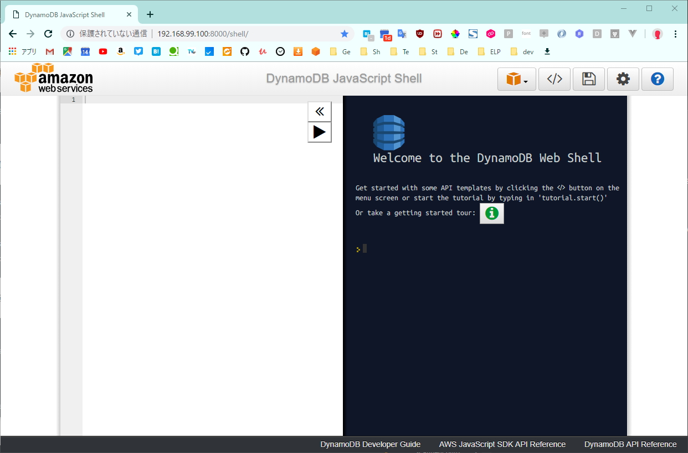
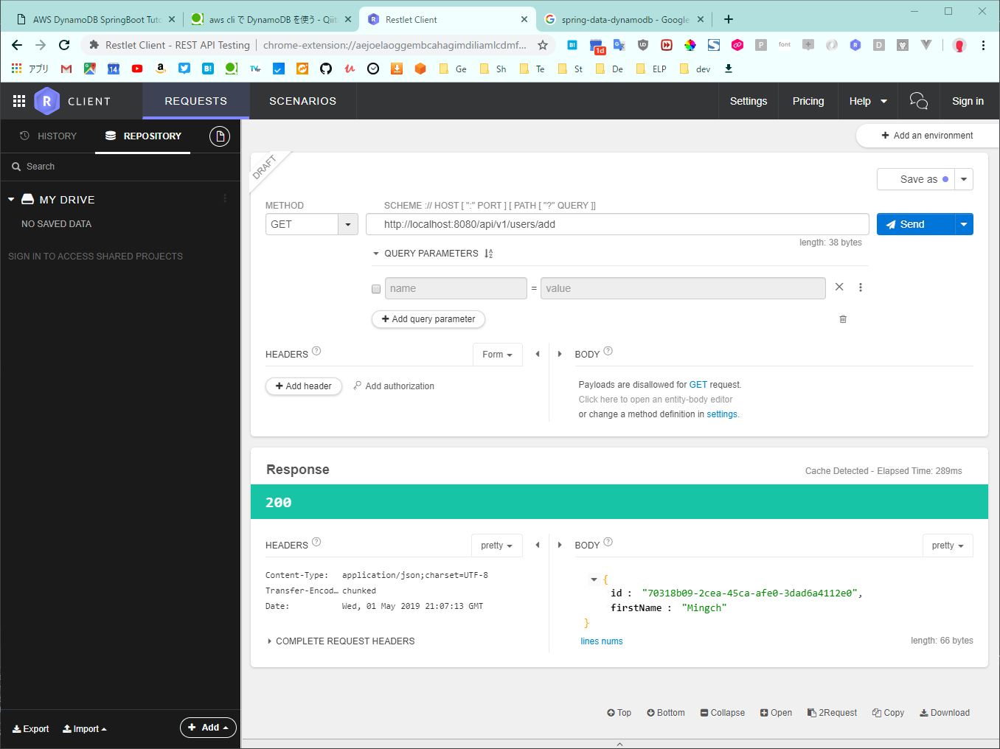
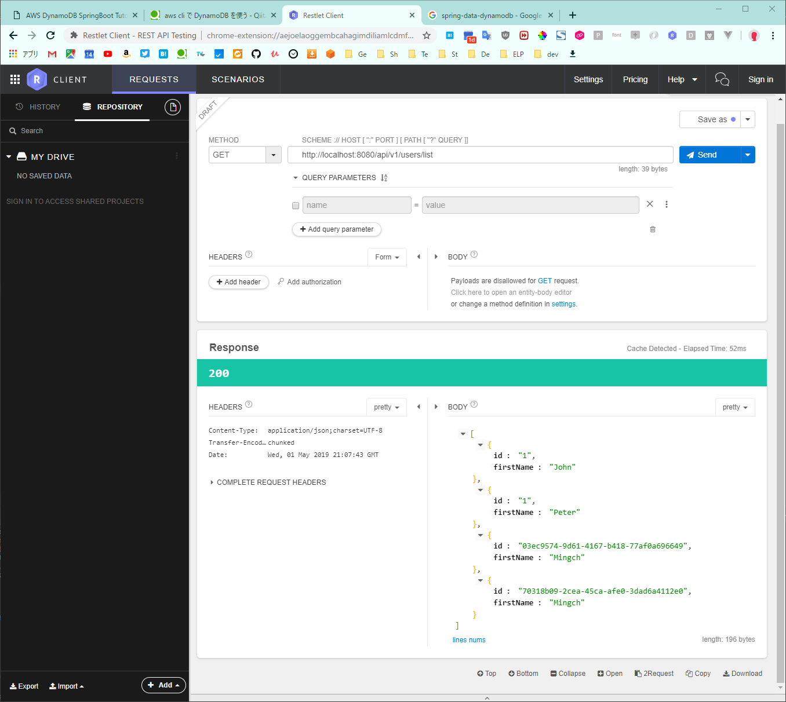

# DynamoDB local と Spring Boot の接続（Spring Data DynamoDB 編）

Spring Data DynamoDBライブラリを使用してDynamoDB localにアクセスする方法の説明。

- [DynamoDB local と Spring Boot の接続（Spring Data DynamoDB 編）](#dynamodb-local-%E3%81%A8-spring-boot-%E3%81%AE%E6%8E%A5%E7%B6%9Aspring-data-dynamodb-%E7%B7%A8)
  - [DynamoDB local の Docker イメージの取得、コンテナ起動](#dynamodb-local-%E3%81%AE-docker-%E3%82%A4%E3%83%A1%E3%83%BC%E3%82%B8%E3%81%AE%E5%8F%96%E5%BE%97%E3%82%B3%E3%83%B3%E3%83%86%E3%83%8A%E8%B5%B7%E5%8B%95)
    - [docker pull](#docker-pull)
    - [docker run](#docker-run)
      - [DynamoDB JavaScript Shell](#dynamodb-javascript-shell)
  - [DynamoDB local への接続](#dynamodb-local-%E3%81%B8%E3%81%AE%E6%8E%A5%E7%B6%9A)
    - [aws CLI を使った操作](#aws-cli-%E3%82%92%E4%BD%BF%E3%81%A3%E3%81%9F%E6%93%8D%E4%BD%9C)
      - [aws config](#aws-config)
      - [テーブル一覧表示](#%E3%83%86%E3%83%BC%E3%83%96%E3%83%AB%E4%B8%80%E8%A6%A7%E8%A1%A8%E7%A4%BA)
      - [テーブル作成](#%E3%83%86%E3%83%BC%E3%83%96%E3%83%AB%E4%BD%9C%E6%88%90)
      - [Item の作成](#item-%E3%81%AE%E4%BD%9C%E6%88%90)
      - [Item の確認](#item-%E3%81%AE%E7%A2%BA%E8%AA%8D)
  - [Spring Boot プロジェクト](#spring-boot-%E3%83%97%E3%83%AD%E3%82%B8%E3%82%A7%E3%82%AF%E3%83%88)
    - [build.gradle](#buildgradle)
    - [DynamoDB Config](#dynamodb-config)
      - [`application.yml`に設定情報を追加](#applicationyml%E3%81%AB%E8%A8%AD%E5%AE%9A%E6%83%85%E5%A0%B1%E3%82%92%E8%BF%BD%E5%8A%A0)
      - [`DynamoDBConfig.java`で接続のための設定](#dynamodbconfigjava%E3%81%A7%E6%8E%A5%E7%B6%9A%E3%81%AE%E3%81%9F%E3%82%81%E3%81%AE%E8%A8%AD%E5%AE%9A)
    - [REST API の実装](#rest-api-%E3%81%AE%E5%AE%9F%E8%A3%85)
      - [`User.java`にテーブルを再現](#userjava%E3%81%AB%E3%83%86%E3%83%BC%E3%83%96%E3%83%AB%E3%82%92%E5%86%8D%E7%8F%BE)
      - [`UserDAO.java`インタフェース](#userdaojava%E3%82%A4%E3%83%B3%E3%82%BF%E3%83%95%E3%82%A7%E3%83%BC%E3%82%B9)
      - [`UserService.java`と実装クラス](#userservicejava%E3%81%A8%E5%AE%9F%E8%A3%85%E3%82%AF%E3%83%A9%E3%82%B9)
      - [`UserController.java`に REST コントローラを定義](#usercontrollerjava%E3%81%AB-rest-%E3%82%B3%E3%83%B3%E3%83%88%E3%83%AD%E3%83%BC%E3%83%A9%E3%82%92%E5%AE%9A%E7%BE%A9)
    - [確認](#%E7%A2%BA%E8%AA%8D)
    - [カスタムメソッドの作成](#%E3%82%AB%E3%82%B9%E3%82%BF%E3%83%A0%E3%83%A1%E3%82%BD%E3%83%83%E3%83%89%E3%81%AE%E4%BD%9C%E6%88%90)

## DynamoDB local の Docker イメージの取得、コンテナ起動

### docker pull

```
$ docker pull amazon/dynamodb-local
```

### docker run

```
$ docker run -d --name dynamodb -p 8000:8000 amazon/dynamodb-local
```

#### DynamoDB JavaScript Shell

http://192.168.99.100:8000/shell/ へアクセスする。



## DynamoDB local への接続

### aws CLI を使った操作

http://codeomitted.com/aws-dynamodb-springboot-tutorial/ を参考とした。

#### aws config

`aws config` で設定を済ませる。以下を参考にする。

https://www.task-notes.com/entry/20141026/1414322858

dynamodb-local だとアクセスキーとシークレットキーが決まっている。一応東京リージョンを指定。

```
PS > aws configure
AWS Access Key ID [None]: key
AWS Secret Access Key [None]: key2
Default region name [ap-northeast-1]:
Default output format [json]:
```

#### テーブル一覧表示

`--endpoint-url` は環境によって変更する。今回は Docker ToolBox を経由して DynamoDB コンテナを使用しているので、以下のようになる。

```
PS > aws dynamodb list-tables --endpoint-url http://192.168.99.100:8000/
```

```json
{
  "TableNames": []
}
```

#### テーブル作成

```
PS > aws dynamodb create-table --table-name User --attribute-definitions AttributeName=Id,AttributeType=S AttributeName=FirstName,AttributeType=S --key-schema AttributeName=Id,KeyType=HASH AttributeName=FirstName,KeyType=RANGE --provisioned-throughput
ReadCapacityUnits=5,WriteCapacityUnits=5 --endpoint-url http://192.168.99.100:8000
```

再度一覧表示すると`User`テーブルが作成されている。

```json
{
  "TableNames": ["User"]
}
```

#### Item の作成

pwsh を使っているため`"`をエスケープしなくてはならない。

```
PS > aws dynamodb put-item --table-name User --item '{ \"Id\" : {\"S\": \"1\"} , \"FirstName\": {\"S\":\"John\"}}' --endpoint-url http://192.168.99.100:8000

PS > aws dynamodb put-item --table-name User --item '{ \"Id\" : {\"S\": \"1\"} , \"FirstName\": {\"S\":\"Peter\"}}' --endpoint-url http://192.168.99.100:8000
```

#### Item の確認

put した Item を確認する。

```
PS > aws dynamodb scan --table-name User --endpoint-url http://192.168.99.100:8000/
```

```
{
    "Items": [
        {
            "FirstName": {
                "S": "John"
            },
            "Id": {
                "S": "1"
            }
        },
        {
            "FirstName": {
                "S": "Peter"
            },
            "Id": {
                "S": "1"
            }
        }
    ],
    "Count": 2,
    "ScannedCount": 2,
    "ConsumedCapacity": null
}
```

## Spring Boot プロジェクト

参考:

- http://codeomitted.com/aws-dynamodb-springboot-tutorial/
- https://derjust.github.io/spring-data-dynamodb/

### build.gradle

```groovy
plugins {
	id 'org.springframework.boot' version '2.1.4.RELEASE'
	id 'java'
}

apply plugin: 'io.spring.dependency-management'

group = 'com.haruspring.dynamodb'
version = '0.0.1-SNAPSHOT'
sourceCompatibility = '11'

configurations {
	compileOnly {
		extendsFrom annotationProcessor
	}
}

repositories {
	mavenCentral()
}

dependencies {
	implementation 'org.springframework.boot:spring-boot-starter-web'
	runtimeOnly 'org.springframework.boot:spring-boot-devtools'
	testImplementation 'org.springframework.boot:spring-boot-starter-test'
	compileOnly 'org.projectlombok:lombok'
	annotationProcessor 'org.projectlombok:lombok'

	// https://mvnrepository.com/artifact/com.github.derjust/spring-data-dynamodb
	compile group: 'com.github.derjust', name: 'spring-data-dynamodb', version: '5.1.0'

	// https://mvnrepository.com/artifact/org.apache.commons/commons-lang3
	compile group: 'org.apache.commons', name: 'commons-lang3', version: '3.9'

}
```

### DynamoDB Config

#### `application.yml`に設定情報を追加

```yml
logging:
  level:
    root: INFO
amazon:
  dynamodb:
    endpoint: http://192.168.99.100:8000
  aws:
    accesskey: key
    secretkey: key2
```

#### `DynamoDBConfig.java`で接続のための設定

```java
@Configuration
@EnableDynamoDBRepositories(basePackages = "com.haruspring.dynamodb.local.repository")
public class DynamoDBConfig {

  @Value("${amazon.dynamodb.endpoint}")
  private String amazonDynamoDBEndpoint;

  @Value("${amazon.aws.accesskey}")
  private String amazonAWSAccessKey;

  @Value("${amazon.aws.secretkey}")
  private String amazonAWSSecretKey;

  @Bean
  public AmazonDynamoDB amazonDynamoDB(AWSCredentials amazonAwsCredentials) {
    AwsClientBuilder.EndpointConfiguration endpointConfiguration =
        new EndpointConfiguration(amazonDynamoDBEndpoint, Regions.AP_NORTHEAST_1.getName());

    AWSStaticCredentialsProvider credentialsProvider =
        new AWSStaticCredentialsProvider(amazonAwsCredentials());

    AmazonDynamoDB amazonDynamoDB =
        AmazonDynamoDBClientBuilder.standard()
            .withEndpointConfiguration(endpointConfiguration)
            .withCredentials(credentialsProvider)
            .build();

    return amazonDynamoDB;
  }

  @Bean
  public AWSCredentials amazonAwsCredentials() {
    return new BasicAWSCredentials(amazonAWSAccessKey, amazonAWSSecretKey);
  }
}
```

### REST API の実装

#### `User.java`にテーブルを再現

```java
@DynamoDBTable(tableName = "User")
public @Data class User {

  @DynamoDBHashKey(attributeName = "Id")
  @DynamoDBAutoGeneratedKey
  private String id;

  @DynamoDBAttribute(attributeName = "FirstName")
  private String firstName;

  // lombokによってgetter setterは不要

}
```

#### `UserDAO.java`インタフェース

```java
@EnableScan
public interface UserDAO extends CrudRepository<User, String> {

  List<User> findByFirstName(String firstName);
}
```

#### `UserService.java`と実装クラス

```java
public interface UserService {
  public User addUser(User user);

  public List<User> listUser();
}
```

```java
@Service
public class UserServiceImpl implements UserService {

  @Autowired private UserDAO userDAO;

  @Override
  public User addUser(User user) {
    return userDAO.save(user);
  }

  @Override
  public List<User> listUser() {
    List<User> result = (List<User>) userDAO.findAll();
    return result;
  }
}
```

#### `UserController.java`に REST コントローラを定義

```java
@RequestMapping("/api/v1/users")
@RestController
public class UserController {

  @Autowired private UserService userService;

  // getメソッドなのはおかしいけどサンプルのため許容
  @GetMapping("add")
  public User addUser() {
    User user = new User();
    user.setFirstName("Mingch");
    user = userService.addUser(user);
    return user;
  }

  @GetMapping("list")
  public List<User> listUser() {
    List<User> list = userService.listUser();
    return list;
  }
}
```

### 確認

Itemが追加され、参照できることを確認する。

http://localhost:8080/api/v1/users/add



http://localhost:8080/api/v1/users/list



### カスタムメソッドの作成

以下を参考に作成する。

https://github.com/derjust/spring-data-dynamodb/wiki/Custom-repository-implementations
